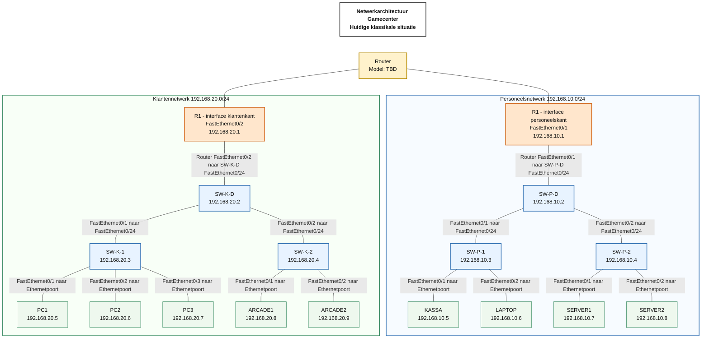

# Gamecenter-netwerklabo

## 1. Inleiding

Deze documentatie beschrijft de huidige netwerktopologie voor een schoolopdracht rond een klein gamecenter. Het labo wordt opgebouwd met fysieke Cisco-switches, een fysieke router en verschillende eindapparaten zoals een kassasysteem, servers, gaming-pc's en arcadekasten.

Het doel van dit document is om de bestaande klassikale topologie overzichtelijk, professioneel en technisch correct vast te leggen. De opgegeven IP-adressen, hostnames en poortverbindingen vormen de bron van waarheid en worden in dit document niet gewijzigd.

Afbeelding van het oorspronkelijke klassikale bordontwerp: nog toe te voegen.

## 2. Doelstellingen

De doelstellingen van dit labo zijn:

- fysieke netwerkapparatuur herkennen;
- een fysieke netwerktopologie opbouwen;
- apparaten via UTP-kabels aansluiten;
- Cisco-apparatuur via een consoleverbinding beheren;
- statische IPv4-adressen instellen;
- switches een management-IP-adres geven;
- twee IPv4-subnetten via een router verbinden;
- connectiviteit testen met `ping`;
- configuraties en testresultaten documenteren.

## 3. Gebruikte apparatuur

| Apparaat | Aantal | Merk en model | Functie | Status | Opmerkingen |
|---|---:|---|---|---|---|
| Router | 1 | TBD | Verbindt het personeelsnetwerk en het klantennetwerk | Gepland | Exact routermodel nog te bepalen |
| Switches | 6 | Cisco Catalyst WS-C3560-24PS-S | Layer 2-connectiviteit en management-IP per switch | Gepland | Verdeeld over personeelskant en klantenkant |
| Kassasysteem | 1 | TBD | Kassawerkstation | Gepland | Hostname: `KASSA` |
| Beheerlaptop | 1 | TBD | Beheer door medewerkers | Gepland | Hostname: `LAPTOP` |
| Servers | 2 | TBD | Serverdiensten binnen het personeelsnetwerk | Gepland | Hostnames: `SERVER1`, `SERVER2` |
| Gaming-pc's | 3 | TBD | Klantentoestellen voor games | Gepland | Hostnames: `PC1`, `PC2`, `PC3` |
| Arcadekasten | 2 | TBD | Klantentoestellen voor arcadegebruik | Gepland | Hostnames: `ARCADE1`, `ARCADE2` |

## 4. Netwerkarchitectuur

Het labo bestaat uit twee afzonderlijke IPv4-subnetten:

| Netwerk | Netwerkadres | CIDR-prefix | Subnetmasker | Default gateway | Broadcastadres | Eerste vrije IP-adres |
|---|---|---:|---|---|---|---|
| Personeelsnetwerk | `192.168.10.0` | `/24` | `255.255.255.0` | `192.168.10.1` | `192.168.10.255` | `192.168.10.9` |
| Klantennetwerk | `192.168.20.0` | `/24` | `255.255.255.0` | `192.168.20.1` | `192.168.20.255` | `192.168.20.10` |

Apparaten binnen hetzelfde subnet communiceren via de switches. De switches sturen gewone Layer 2-frames door op basis van MAC-adressen. De IP-adressen van de switches zijn management-IP-adressen. Een management-IP-adres is nodig om een switch via het netwerk te beheren, maar is niet nodig om gewone Layer 2-frames door te sturen.

De router heeft een rechtstreeks aangesloten interface in elk subnet. Routerinterface `FastEthernet0/1` is de gateway van het personeelsnetwerk. Routerinterface `FastEthernet0/2` is de gateway van het klantennetwerk. Omdat beide netwerken rechtstreeks op de router zijn aangesloten, kan de router verkeer tussen deze twee subnetten routeren. Voor deze twee rechtstreeks aangesloten netwerken zijn voorlopig geen extra statische routes nodig.

`R1` is één fysieke router met twee interfaces. `R1 - interface personeelskant` gebruikt `192.168.10.1/24`. `R1 - interface klantenkant` gebruikt `192.168.20.1/24`. Het is dus correct dat dezelfde routerhostname `R1` bij beide routerinterfaces voorkomt.

De centrale switches verbinden de router met de toegangsswitches. De toegangsswitches verbinden de eindapparaten met het juiste subnet. De exacte benaming van de routerinterfaces moet later worden gecontroleerd zodra het routermodel bekend is. In deze versie worden de klassikaal afgesproken namen `FastEthernet0/1` en `FastEthernet0/2` gebruikt.

## 5. Topologiediagram

Figuur – Netwerkarchitectuur van het gamecenter met een afzonderlijk personeels- en klantennetwerk.

Deze architectuur geeft de huidige klassikale situatie weer. De documentatie is nog in uitvoering en de architectuur kan later worden bijgewerkt wanneer de praktische opstelling verandert.

## 6. IP-adresseringsplan

### Personeelskant

| Apparaat | Hostname | IP-adres | Subnetmasker | Default gateway | Adrestype | Functie |
|---|---|---|---|---|---|---|
| Routerinterface personeelskant | `R1 - interface personeelskant` | `192.168.10.1` | `255.255.255.0` | Niet van toepassing | Statisch | Gateway van het personeelsnetwerk |
| Centrale switch personeelskant | `SW-P-D` | `192.168.10.2` | `255.255.255.0` | `192.168.10.1` | Statisch | Verbindt de kassaswitch en serverswitch met de router |
| Switch kassa en beheer | `SW-P-1` | `192.168.10.3` | `255.255.255.0` | `192.168.10.1` | Statisch | Verbindt het kassasysteem en de beheerlaptop |
| Switch servers | `SW-P-2` | `192.168.10.4` | `255.255.255.0` | `192.168.10.1` | Statisch | Verbindt de twee servers |
| Kassasysteem | `KASSA` | `192.168.10.5` | `255.255.255.0` | `192.168.10.1` | Statisch | Kassasysteem |
| Beheerlaptop | `LAPTOP` | `192.168.10.6` | `255.255.255.0` | `192.168.10.1` | Statisch | Beheer door medewerkers |
| Eerste server | `SERVER1` | `192.168.10.7` | `255.255.255.0` | `192.168.10.1` | Statisch | Eerste server |
| Tweede server | `SERVER2` | `192.168.10.8` | `255.255.255.0` | `192.168.10.1` | Statisch | Tweede server |

### Klantenkant

| Apparaat | Hostname | IP-adres | Subnetmasker | Default gateway | Adrestype | Functie |
|---|---|---|---|---|---|---|
| Routerinterface klantenkant | `R1 - interface klantenkant` | `192.168.20.1` | `255.255.255.0` | Niet van toepassing | Statisch | Gateway van het klantennetwerk |
| Centrale switch klantenkant | `SW-K-D` | `192.168.20.2` | `255.255.255.0` | `192.168.20.1` | Statisch | Verbindt de pc-switch en arcadeswitch met de router |
| Switch gaming-pc's | `SW-K-1` | `192.168.20.3` | `255.255.255.0` | `192.168.20.1` | Statisch | Verbindt de drie gaming-pc's |
| Switch arcadekasten | `SW-K-2` | `192.168.20.4` | `255.255.255.0` | `192.168.20.1` | Statisch | Verbindt de twee arcadekasten |
| Gaming-pc 1 | `PC1` | `192.168.20.5` | `255.255.255.0` | `192.168.20.1` | Statisch | Gaming-pc |
| Gaming-pc 2 | `PC2` | `192.168.20.6` | `255.255.255.0` | `192.168.20.1` | Statisch | Gaming-pc |
| Gaming-pc 3 | `PC3` | `192.168.20.7` | `255.255.255.0` | `192.168.20.1` | Statisch | Gaming-pc |
| Arcadekast 1 | `ARCADE1` | `192.168.20.8` | `255.255.255.0` | `192.168.20.1` | Statisch | Eerste arcadekast |
| Arcadekast 2 | `ARCADE2` | `192.168.20.9` | `255.255.255.0` | `192.168.20.1` | Statisch | Tweede arcadekast |

## 7. Poortenplan

### Personeelskant

| Apparaat A | Poort A | Apparaat B | Poort B | Functie van de verbinding | Status |
|---|---|---|---|---|---|
| Router | `FastEthernet0/1` | `SW-P-D` | `FastEthernet0/24` | Verbinding tussen router en personeelsnetwerk | Gepland |
| `SW-P-D` | `FastEthernet0/1` | `SW-P-1` | `FastEthernet0/24` | Verbinding naar kassa- en beheerswitch | Gepland |
| `SW-P-D` | `FastEthernet0/2` | `SW-P-2` | `FastEthernet0/24` | Verbinding naar serverswitch | Gepland |
| `SW-P-1` | `FastEthernet0/1` | `KASSA` | Ethernetpoort | Verbinding naar het kassasysteem | Gepland |
| `SW-P-1` | `FastEthernet0/2` | `LAPTOP` | Ethernetpoort | Verbinding naar de beheerlaptop | Gepland |
| `SW-P-2` | `FastEthernet0/1` | `SERVER1` | Ethernetpoort | Verbinding naar Server 1 | Gepland |
| `SW-P-2` | `FastEthernet0/2` | `SERVER2` | Ethernetpoort | Verbinding naar Server 2 | Gepland |

### Klantenkant

| Apparaat A | Poort A | Apparaat B | Poort B | Functie van de verbinding | Status |
|---|---|---|---|---|---|
| Router | `FastEthernet0/2` | `SW-K-D` | `FastEthernet0/24` | Verbinding tussen router en klantennetwerk | Gepland |
| `SW-K-D` | `FastEthernet0/1` | `SW-K-1` | `FastEthernet0/24` | Verbinding naar de switch met gaming-pc's | Gepland |
| `SW-K-D` | `FastEthernet0/2` | `SW-K-2` | `FastEthernet0/24` | Verbinding naar de arcadeswitch | Gepland |
| `SW-K-1` | `FastEthernet0/1` | `PC1` | Ethernetpoort | Verbinding naar PC 1 | Gepland |
| `SW-K-1` | `FastEthernet0/2` | `PC2` | Ethernetpoort | Verbinding naar PC 2 | Gepland |
| `SW-K-1` | `FastEthernet0/3` | `PC3` | Ethernetpoort | Verbinding naar PC 3 | Gepland |
| `SW-K-2` | `FastEthernet0/1` | `ARCADE1` | Ethernetpoort | Verbinding naar Arcade 1 | Gepland |
| `SW-K-2` | `FastEthernet0/2` | `ARCADE2` | Ethernetpoort | Verbinding naar Arcade 2 | Gepland |

## 8. Klassikale werkverdeling

| Groep | Verantwoordelijk materiaal | Bekabeling | Configuratietaken | Testtaken | Documentatietaken |
|---|---|---|---|---|---|
| 1. Kassa en beheer | `SW-P-1`, `KASSA`, `LAPTOP` | UTP-kabels tussen switch, kassasysteem, laptop en centrale switch | Hostnames controleren, management-IP van de switch voorbereiden, statische IP-adressen op eindapparaten instellen | Pingtests binnen personeelsnetwerk uitvoeren | Poorten, IP-adressen en testresultaten noteren |
| 2. Servers | `SW-P-2`, `SERVER1`, `SERVER2` | UTP-kabels tussen servers, serverswitch en centrale switch | Hostnames controleren, management-IP van de switch voorbereiden, statische IP-adressen op servers instellen | Pingtests vanaf en naar servers uitvoeren | Servergegevens en testresultaten documenteren |
| 3. Gaming-pc's | `SW-K-1`, `PC1`, `PC2`, `PC3` | UTP-kabels tussen pc's, pc-switch en centrale switch | Hostnames controleren, management-IP van de switch voorbereiden, statische IP-adressen op pc's instellen | Pingtests binnen klantennetwerk uitvoeren | Pc-gegevens en testresultaten documenteren |
| 4. Arcadekasten | `SW-K-2`, `ARCADE1`, `ARCADE2` | UTP-kabels tussen arcadekasten, arcadeswitch en centrale switch | Hostnames controleren, management-IP van de switch voorbereiden, statische IP-adressen op arcadekasten instellen | Pingtests vanaf en naar arcadekasten uitvoeren | Arcadegegevens en testresultaten documenteren |
| 5. Router, centrale switches en algemene integratie | Router, `SW-P-D`, `SW-K-D` | UTP-kabels tussen router en beide centrale switches | Routerinterfaces configureren, management-IP's van centrale switches voorbereiden, algemene integratie controleren | Routing tussen de twee netwerken testen | Algemene topologie, openstaande vragen en eindstatus documenteren |

## 9. Uitvoeringsvolgorde

1. Materiaal inventariseren.
2. Alle apparaten fysiek labelen.
3. Modellen en serienummers noteren.
4. Consoletoegang testen.
5. Bestaande configuraties controleren.
6. Alleen met toestemming oude configuraties wissen.
7. Hostnames instellen.
8. Management-IP-adressen van de switches instellen.
9. Routerinterfaces configureren.
10. Apparaten volgens het poortenplan verbinden.
11. Eindapparaten aansluiten.
12. Statische IP-adressen instellen.
13. Verbindingen binnen het personeelsnetwerk testen.
14. Verbindingen binnen het klantennetwerk testen.
15. Routing tussen de twee netwerken testen.
16. Configuraties opslaan.
17. Resultaten en eventuele fouten documenteren.

## 10. Configuratieplan

### Router

Te configureren:

- hostname `R1`;
- routermodel controleren: `TBD`;
- interface `FastEthernet0/1` configureren met IP-adres `192.168.10.1` en subnetmasker `255.255.255.0`;
- interface `FastEthernet0/2` configureren met IP-adres `192.168.20.1` en subnetmasker `255.255.255.0`;
- controleren of de interfacenamen werkelijk `FastEthernet0/1` en `FastEthernet0/2` zijn;
- interfaces activeren indien ze administratief uitgeschakeld zijn;
- configuratie opslaan na controle en toestemming.

Definitieve Cisco IOS-configuratie: `TBD`.

### SW-P-D

Te configureren:

- hostname `SW-P-D`;
- management-IP `192.168.10.2`;
- subnetmasker `255.255.255.0`;
- default gateway `192.168.10.1`;
- poorten `FastEthernet0/1`, `FastEthernet0/2` en `FastEthernet0/24` controleren en activeren indien nodig.

Definitieve Cisco IOS-configuratie: `TBD`.

### SW-P-1

Te configureren:

- hostname `SW-P-1`;
- management-IP `192.168.10.3`;
- subnetmasker `255.255.255.0`;
- default gateway `192.168.10.1`;
- poorten `FastEthernet0/1`, `FastEthernet0/2` en `FastEthernet0/24` controleren en activeren indien nodig.

Definitieve Cisco IOS-configuratie: `TBD`.

### SW-P-2

Te configureren:

- hostname `SW-P-2`;
- management-IP `192.168.10.4`;
- subnetmasker `255.255.255.0`;
- default gateway `192.168.10.1`;
- poorten `FastEthernet0/1`, `FastEthernet0/2` en `FastEthernet0/24` controleren en activeren indien nodig.

Definitieve Cisco IOS-configuratie: `TBD`.

### SW-K-D

Te configureren:

- hostname `SW-K-D`;
- management-IP `192.168.20.2`;
- subnetmasker `255.255.255.0`;
- default gateway `192.168.20.1`;
- poorten `FastEthernet0/1`, `FastEthernet0/2` en `FastEthernet0/24` controleren en activeren indien nodig.

Definitieve Cisco IOS-configuratie: `TBD`.

### SW-K-1

Te configureren:

- hostname `SW-K-1`;
- management-IP `192.168.20.3`;
- subnetmasker `255.255.255.0`;
- default gateway `192.168.20.1`;
- poorten `FastEthernet0/1`, `FastEthernet0/2`, `FastEthernet0/3` en `FastEthernet0/24` controleren en activeren indien nodig.

Definitieve Cisco IOS-configuratie: `TBD`.

### SW-K-2

Te configureren:

- hostname `SW-K-2`;
- management-IP `192.168.20.4`;
- subnetmasker `255.255.255.0`;
- default gateway `192.168.20.1`;
- poorten `FastEthernet0/1`, `FastEthernet0/2` en `FastEthernet0/24` controleren en activeren indien nodig.

Definitieve Cisco IOS-configuratie: `TBD`.

### Kassasysteem

Te configureren:

- hostname `KASSA`;
- IP-adres `192.168.10.5`;
- subnetmasker `255.255.255.0`;
- default gateway `192.168.10.1`;
- DNS-instellingen: `TBD`;
- netwerkadapter controleren.

### Beheerlaptop

Te configureren:

- hostname `LAPTOP`;
- IP-adres `192.168.10.6`;
- subnetmasker `255.255.255.0`;
- default gateway `192.168.10.1`;
- DNS-instellingen: `TBD`;
- consoletoegang tot Cisco-apparatuur controleren.

### Servers

Te configureren:

- hostname `SERVER1` met IP-adres `192.168.10.7`;
- hostname `SERVER2` met IP-adres `192.168.10.8`;
- subnetmasker `255.255.255.0`;
- default gateway `192.168.10.1`;
- DNS-instellingen: `TBD`;
- serverrollen of diensten: `TBD`.

### Gaming-pc's

Te configureren:

- hostname `PC1` met IP-adres `192.168.20.5`;
- hostname `PC2` met IP-adres `192.168.20.6`;
- hostname `PC3` met IP-adres `192.168.20.7`;
- subnetmasker `255.255.255.0`;
- default gateway `192.168.20.1`;
- DNS-instellingen: `TBD`;
- netwerkadapter controleren.

### Arcadekasten

Te configureren:

- hostname `ARCADE1` met IP-adres `192.168.20.8`;
- hostname `ARCADE2` met IP-adres `192.168.20.9`;
- subnetmasker `255.255.255.0`;
- default gateway `192.168.20.1`;
- DNS-instellingen: `TBD`;
- netwerkadapter controleren.

## 11. Testplan

| Testnummer | Bronapparaat | Bron-IP | Bestemmingsapparaat | Bestemmings-IP | Doel | Verwacht resultaat | Werkelijk resultaat | Status | Opmerkingen |
|---:|---|---|---|---|---|---|---|---|---|
| 1 | `KASSA` | `192.168.10.5` | `LAPTOP` | `192.168.10.6` | Connectiviteit binnen personeelsnetwerk testen | Ping succesvol | TBD | Nog niet uitgevoerd | Personeelsnetwerk |
| 2 | `KASSA` | `192.168.10.5` | `SERVER1` | `192.168.10.7` | Connectiviteit naar server testen | Ping succesvol | TBD | Nog niet uitgevoerd | Personeelsnetwerk |
| 3 | `KASSA` | `192.168.10.5` | `SERVER2` | `192.168.10.8` | Connectiviteit naar server testen | Ping succesvol | TBD | Nog niet uitgevoerd | Personeelsnetwerk |
| 4 | `KASSA` | `192.168.10.5` | Router gateway personeel | `192.168.10.1` | Default gateway testen | Ping succesvol | TBD | Nog niet uitgevoerd | Personeelsnetwerk |
| 5 | `LAPTOP` | `192.168.10.6` | `SW-P-D` | `192.168.10.2` | Management-IP centrale switch testen | Ping succesvol | TBD | Nog niet uitgevoerd | Personeelsnetwerk |
| 6 | `LAPTOP` | `192.168.10.6` | `SW-P-1` | `192.168.10.3` | Management-IP kassaswitch testen | Ping succesvol | TBD | Nog niet uitgevoerd | Personeelsnetwerk |
| 7 | `LAPTOP` | `192.168.10.6` | `SW-P-2` | `192.168.10.4` | Management-IP serverswitch testen | Ping succesvol | TBD | Nog niet uitgevoerd | Personeelsnetwerk |
| 8 | `PC1` | `192.168.20.5` | `PC2` | `192.168.20.6` | Connectiviteit binnen klantennetwerk testen | Ping succesvol | TBD | Nog niet uitgevoerd | Klantennetwerk |
| 9 | `PC1` | `192.168.20.5` | `PC3` | `192.168.20.7` | Connectiviteit binnen klantennetwerk testen | Ping succesvol | TBD | Nog niet uitgevoerd | Klantennetwerk |
| 10 | `PC1` | `192.168.20.5` | `ARCADE1` | `192.168.20.8` | Connectiviteit naar arcadekast testen | Ping succesvol | TBD | Nog niet uitgevoerd | Klantennetwerk |
| 11 | `PC1` | `192.168.20.5` | `ARCADE2` | `192.168.20.9` | Connectiviteit naar arcadekast testen | Ping succesvol | TBD | Nog niet uitgevoerd | Klantennetwerk |
| 12 | `PC1` | `192.168.20.5` | Router gateway klanten | `192.168.20.1` | Default gateway testen | Ping succesvol | TBD | Nog niet uitgevoerd | Klantennetwerk |
| 13 | `PC1` | `192.168.20.5` | `SW-K-D` | `192.168.20.2` | Management-IP centrale switch testen | Ping succesvol | TBD | Nog niet uitgevoerd | Klantennetwerk |
| 14 | `PC1` | `192.168.20.5` | `SW-K-1` | `192.168.20.3` | Management-IP pc-switch testen | Ping succesvol | TBD | Nog niet uitgevoerd | Klantennetwerk |
| 15 | `PC1` | `192.168.20.5` | `SW-K-2` | `192.168.20.4` | Management-IP arcadeswitch testen | Ping succesvol | TBD | Nog niet uitgevoerd | Klantennetwerk |
| 16 | `KASSA` | `192.168.10.5` | `PC1` | `192.168.20.5` | Routing tussen netwerken testen | Ping succesvol als routering werkt en firewalls dit toelaten | TBD | Nog niet uitgevoerd | Tussen twee netwerken |
| 17 | `LAPTOP` | `192.168.10.6` | `ARCADE1` | `192.168.20.8` | Routing tussen netwerken testen | Ping succesvol als routering werkt en firewalls dit toelaten | TBD | Nog niet uitgevoerd | Tussen twee netwerken |
| 18 | `SERVER1` | `192.168.10.7` | `PC2` | `192.168.20.6` | Routing tussen netwerken testen | Ping succesvol als routering werkt en firewalls dit toelaten | TBD | Nog niet uitgevoerd | Tussen twee netwerken |
| 19 | `PC3` | `192.168.20.7` | `SERVER2` | `192.168.10.8` | Routing tussen netwerken testen | Ping succesvol als routering werkt en firewalls dit toelaten | TBD | Nog niet uitgevoerd | Tussen twee netwerken |
| 20 | `ARCADE2` | `192.168.20.9` | `KASSA` | `192.168.10.5` | Routing tussen netwerken testen | Ping succesvol als routering werkt en firewalls dit toelaten | TBD | Nog niet uitgevoerd | Tussen twee netwerken |

## 12. Troubleshooting

| Probleem | Mogelijke oorzaak | Controlemethode | Mogelijke oplossing |
|---|---|---|---|
| Geen link-led | Kabel niet aangesloten of defecte poort | Controleer link-leds op beide apparaten | Kabel opnieuw aansluiten of andere poort testen |
| Verkeerde kabel | Onjuist kabeltype gebruikt | Kabeltype visueel controleren en vergelijken met afspraken | Correcte UTP-kabel gebruiken |
| Kabel niet correct aangesloten | Stekker zit niet goed vast | Fysieke verbinding controleren | Kabel opnieuw insteken tot de connector vastklikt |
| Verkeerde switchpoort | Apparaat aangesloten op een andere poort dan het poortenplan | Poortlabels en poortenplan vergelijken | Kabel verplaatsen naar de juiste poort |
| Fysieke interface staat administratively down | Interface is administratief uitgeschakeld | Cisco-commando `show ip interface brief` gebruiken | Interface activeren indien toegestaan |
| Routerinterface staat shutdown | Routerinterface is niet geactiveerd | Cisco-commando `show ip interface brief` gebruiken | Routerinterface activeren indien toegestaan |
| Fout IP-adres | Verkeerd statisch IP-adres ingesteld | IP-configuratie op apparaat controleren | Correct IP-adres instellen volgens IP-adresseringsplan |
| Fout subnetmasker | Subnetmasker wijkt af van `255.255.255.0` | IP-configuratie controleren | Subnetmasker corrigeren naar `255.255.255.0` |
| Fout ingestelde default gateway | Gateway wijkt af van `.1` in het juiste subnet | IP-configuratie controleren | Gateway corrigeren naar `192.168.10.1` of `192.168.20.1` |
| Dubbel IP-adres | Twee apparaten gebruiken hetzelfde IP-adres | IP-adressen vergelijken en ARP-meldingen controleren | Uniek IP-adres instellen volgens plan |
| Windows Firewall blokkeert ICMP/ping | ICMP echo requests worden geblokkeerd | Firewallinstellingen controleren | ICMP tijdelijk toestaan volgens klasafspraken |
| Netwerkadapter van een eindapparaat is uitgeschakeld | Adapter staat disabled | Netwerkinstellingen van het apparaat controleren | Adapter inschakelen |
| Configuratie werd niet opgeslagen | Running-config is niet naar startup-config geschreven | Na herstart controleren of configuratie behouden bleef | Configuratie opslaan volgens klasafspraken |
| Poort werkt op een verkeerde snelheid of duplexinstelling | Speed- of duplex-mismatch | Interface-status en fouttellers controleren | Snelheid en duplex corrigeren of auto-negotiation gebruiken volgens afspraken |

## 13. Resultaten

### Uitgevoerde configuraties

| Datum | Apparaat | Uitgevoerde configuratie | Uitgevoerd door | Gecontroleerd door | Opmerkingen |
|---|---|---|---|---|---|
| TBD | TBD | TBD | TBD | TBD | TBD |

### Pingtests

| Datum | Testnummer | Bronapparaat | Bestemmingsapparaat | Resultaat | Uitgevoerd door | Opmerkingen |
|---|---:|---|---|---|---|---|
| TBD | TBD | TBD | TBD | TBD | TBD | TBD |

### Gevonden fouten

| Datum | Apparaat of verbinding | Fout | Impact | Gevonden door | Opmerkingen |
|---|---|---|---|---|---|
| TBD | TBD | TBD | TBD | TBD | TBD |

### Uitgevoerde oplossingen

| Datum | Probleem | Oplossing | Uitgevoerd door | Gecontroleerd door | Opmerkingen |
|---|---|---|---|---|---|
| TBD | TBD | TBD | TBD | TBD | TBD |

### Eindstatus van ieder apparaat

| Apparaat | Hostname | IP-adres | Fysiek aangesloten | Configuratie opgeslagen | Pingtest geslaagd | Eindstatus | Opmerkingen |
|---|---|---|---|---|---|---|---|
| Routerinterface personeelskant | `R1 - interface personeelskant` | `192.168.10.1` | TBD | TBD | TBD | TBD | Routermodel nog onbekend |
| Routerinterface klantenkant | `R1 - interface klantenkant` | `192.168.20.1` | TBD | TBD | TBD | TBD | Routermodel nog onbekend |
| Centrale switch personeelskant | `SW-P-D` | `192.168.10.2` | TBD | TBD | TBD | TBD | TBD |
| Switch kassa en beheer | `SW-P-1` | `192.168.10.3` | TBD | TBD | TBD | TBD | TBD |
| Switch servers | `SW-P-2` | `192.168.10.4` | TBD | TBD | TBD | TBD | TBD |
| Kassasysteem | `KASSA` | `192.168.10.5` | TBD | Niet van toepassing | TBD | TBD | TBD |
| Beheerlaptop | `LAPTOP` | `192.168.10.6` | TBD | Niet van toepassing | TBD | TBD | TBD |
| Eerste server | `SERVER1` | `192.168.10.7` | TBD | Niet van toepassing | TBD | TBD | TBD |
| Tweede server | `SERVER2` | `192.168.10.8` | TBD | Niet van toepassing | TBD | TBD | TBD |
| Centrale switch klantenkant | `SW-K-D` | `192.168.20.2` | TBD | TBD | TBD | TBD | TBD |
| Switch gaming-pc's | `SW-K-1` | `192.168.20.3` | TBD | TBD | TBD | TBD | TBD |
| Switch arcadekasten | `SW-K-2` | `192.168.20.4` | TBD | TBD | TBD | TBD | TBD |
| Gaming-pc 1 | `PC1` | `192.168.20.5` | TBD | Niet van toepassing | TBD | TBD | TBD |
| Gaming-pc 2 | `PC2` | `192.168.20.6` | TBD | Niet van toepassing | TBD | TBD | TBD |
| Gaming-pc 3 | `PC3` | `192.168.20.7` | TBD | Niet van toepassing | TBD | TBD | TBD |
| Arcadekast 1 | `ARCADE1` | `192.168.20.8` | TBD | Niet van toepassing | TBD | TBD | TBD |
| Arcadekast 2 | `ARCADE2` | `192.168.20.9` | TBD | Niet van toepassing | TBD | TBD | TBD |

## 14. Openstaande vragen

- Wat is het exacte routermodel?
- Zijn de routerinterfaces werkelijk `FastEthernet0/1` en `FastEthernet0/2`?
- Welke IOS-versie draait op de router?
- Welke IOS-versie draait op de switches?
- Welke kabeltypes worden exact gebruikt?
- Welke consolekabel of USB-adapter wordt gebruikt?
- Moet SSH worden ingesteld?
- Welke wachtwoorden worden gebruikt?
- Moeten ongebruikte poorten worden uitgeschakeld?
- Moet verkeer tussen personeel en klanten later worden beperkt?
- Moeten de apparaten later DHCP gebruiken?
- Moeten er later VLAN's worden toegevoegd?

## 15. Conclusie

Dit voorlopige ontwerp bestaat uit twee afzonderlijke `/24`-subnetten: het personeelsnetwerk `192.168.10.0/24` en het klantennetwerk `192.168.20.0/24`. Beide subnetten worden verbonden door een router met een rechtstreeks aangesloten interface in elk subnet.

Ieder subnet bevat drie switches. Aan de personeelskant zijn dat `SW-P-D`, `SW-P-1` en `SW-P-2`. Aan de klantenkant zijn dat `SW-K-D`, `SW-K-1` en `SW-K-2`.

De praktische configuratie, de exacte apparaatmodellen en de testresultaten worden later aangevuld zodra deze gegevens klassikaal bevestigd en uitgevoerd zijn.
